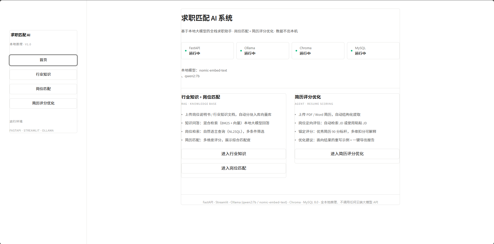
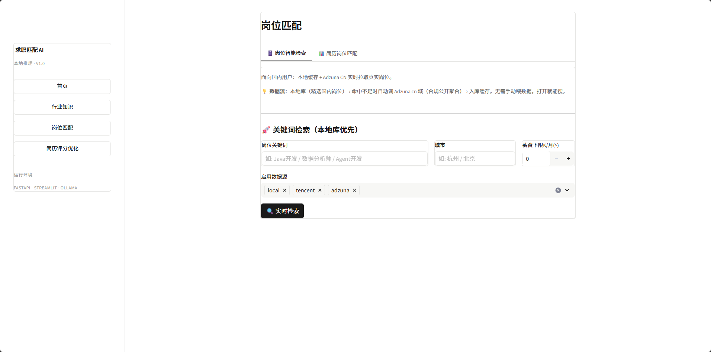
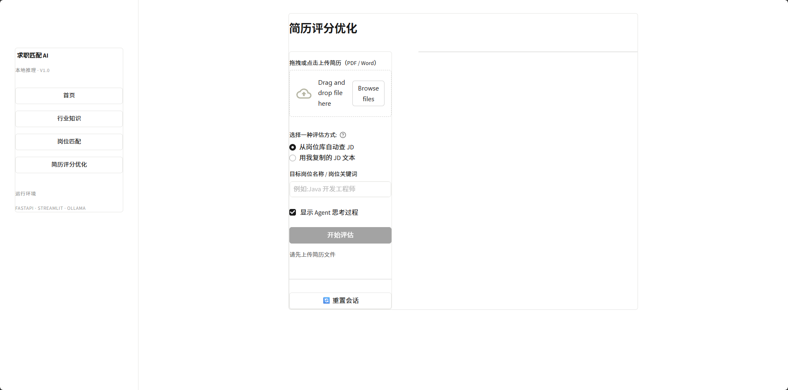
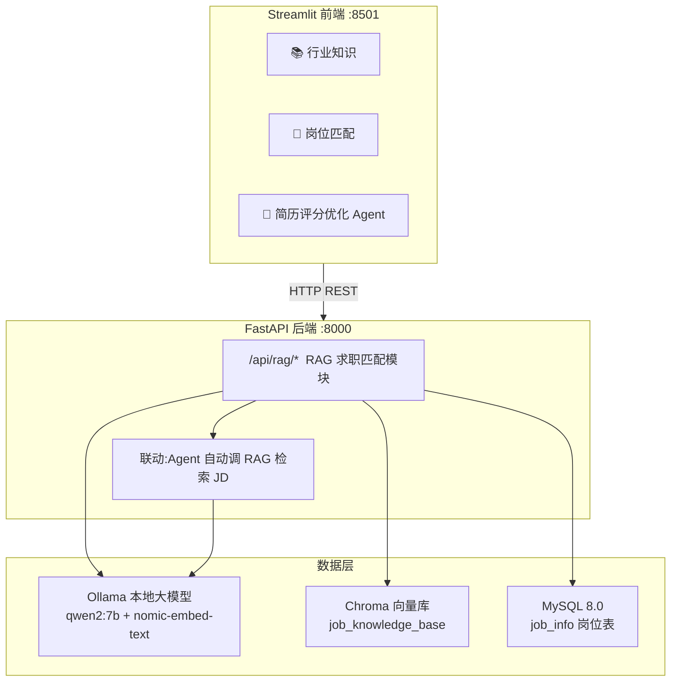

# 求职匹配 AI 系统（全本地私有化部署）

> **RAG 求职匹配 + ReAct Agent 简历评分优化** | FastAPI + Streamlit + Ollama + Chroma + MySQL
>
> ✅ pytest 44 用例通过 · ✅ Docker 四服务一键部署 · ✅ 全本地推理 0 token 成本
>
> [](https://github.com/kami0625/job-match-ai/actions/workflows/ci.yml)

基于 **本地 Ollama** 的求职智能助手，融合「RAG 岗位匹配」与「简历评分优化 Agent」两大功能板块。
全程本地推理，**不调用任何第三方云端大模型 API**，简历与文档数据不出本机。

## 界面预览

| 首页 | 岗位匹配 | 简历评分 |
| ---- | ---- | ---- |
|  |  |  |

## 一、系统架构



```
┌──────────────────────────────────────────────────────────┐
│                    Streamlit 前端（8501）                  │
│   📚 行业知识  │  🎯 岗位匹配  │  📋 简历评分优化（Agent）   │
└──────────────────────────┬───────────────────────────────┘
                           │ HTTP（REST / multipart 文件上传）
┌──────────────────────────▼───────────────────────────────┐
│                    FastAPI 后端（8000）                    │
│  /api/rag/*      RAG 求职匹配模块（api 接口层 / service 业务层）│
│  /api/agent/*    简历评分 Agent 模块（api / service / tools）│
└───────┬───────────────────┬───────────────────┬───────────┘
        │                   │                   │
┌───────▼───────┐   ┌───────▼───────┐   ┌───────▼─────────────┐
│ Ollama 本地    │   │  Chroma       │   │  MySQL 8.0          │
│ qwen2:7b       │   │  向量库        │   │  job_info 岗位表     │
│ nomic-embed    │   │  job_knowledge│   │  （NL2SQL 查询）     │
│                │   │  _base        │   │                     │
└───────────────┘   └───────────────┘   └─────────────────────┘
```

- **📚 行业知识**：行业知识库上传（向量化入库）+ 知识问答 RAG（混合检索），走 `/api/rag/*`。
- **🎯 岗位匹配**：岗位智能检索（NL2SQL + 多数据源）+ 简历与岗位匹配（匹配度 % 展示），走 `/api/rag/*`。
- **📋 简历评分优化**：ReAct Agent 智能体，多轮工具调用（解析简历 → 获取 JD → 多维打分 → 优化建议），走 `/api/agent/*`，内部调用 `/api/rag/*`。

## 二、目录结构

```
├── docs/                        # 项目文档（技术规格说明书 + 界面截图）
├── tests/                       # pytest 自动化测试（44 用例:评分/NL2SQL/检索/解析/API）
├── docker/                      # Docker 编排（backend/frontend 镜像 + compose 四服务）
├── app/                         # FastAPI 后端主目录
│   ├── main.py                  # 启动入口，统一挂载路由 + 全局异常/校验错误中文化
│   ├── config.py                # 全局配置（读取 .env）
│   ├── utils/                   # 通用工具层（所有模块共享）
│   │   ├── ollama_client.py     # Ollama 统一调用封装（对话/嵌入/重试/降级）
│   │   ├── doc_parser.py        # PDF/Word 文档解析与文本分块
│   │   └── common_tools.py      # 统一响应/日志/JSON解析等工具
│   ├── dao/                     # 数据访问层
│   │   ├── mysql_db.py          # MySQL 连接池与基础操作
│   │   ├── chroma_db.py         # Chroma 向量库（去重入库/向量检索）
│   │   └── external_api.py      # 外部合规岗位数据源（可插拔 DataSource 注册表）
│   └── modules/                 # 业务模块
│       ├── rag_module/          # RAG 求职匹配（api 接口层 / service 业务层）
│       └── agent_module/        # 简历评分 ReAct Agent（config / tools / memory / parser / service / api）
├── frontend/                    # Streamlit 前端
│   ├── Home.py                  # 首页（页面导航）
│   └── pages/
│       ├── 1_行业知识.py         # 📚 行业知识库上传 + 知识问答 RAG
│       ├── 2_岗位匹配.py         # 🎯 岗位智能检索 + 简历岗位匹配
│       └── 3_简历评分优化.py     # 📋 ReAct Agent 简历评分优化
├── data/                        # 本地数据（chroma_db 向量库 / upload_files 上传文件 / demo 样例）
├── .env.example                 # 环境变量示例
├── requirements.txt             # 全项目依赖清单
└── README.md
```

## 三、一键部署（Docker Compose）

> 推荐方式：无需手动装 MySQL / Ollama / Chroma，一条命令起全部服务。

```bash
# 1. 配置环境变量(可选,默认 root/123456)
cp .env.example .env

# 2. 一键构建并启动(首次需拉取镜像与模型,约 5-10 分钟)
docker compose -f docker/docker-compose.yml up -d --build

# 3. 首次启动 ollama 会自动拉取 qwen2:7b + nomic-embed-text(若未自动拉取)
docker exec -it jobmatch-ollama ollama pull qwen2:7b
docker exec -it jobmatch-ollama ollama pull nomic-embed-text

# 4. 访问
#    前端 http://localhost:8501
#    后端 http://localhost:8000/docs
```

服务编排（4 容器）：

| 服务 | 容器名 | 端口 | 说明 |
| ---- | ---- | ---- | ---- |
| mysql | jobmatch-mysql | 3306 | MySQL 8.0，自动建库 + 导入样例岗位数据 |
| ollama | jobmatch-ollama | 11434 | 本地大模型，自动拉取 qwen2:7b + nomic-embed-text |
| backend | jobmatch-backend | 8000 | FastAPI，等待 MySQL/Ollama 健康后启动 |
| frontend | jobmatch-frontend | 8501 | Streamlit，等待后端健康后启动 |

停止：`docker compose -f docker/docker-compose.yml down`（加 `-v` 同时清空数据卷）。

## 四、自动化测试（pytest 44 用例）

```bash
pip install pytest
pytest tests/ -v
```

| 测试文件 | 覆盖范围 | 用例数 |
| ---- | ---- | ---- |
| `tests/test_benchmark.py` | 锚定评分四档区分度（潦草/普通/良好/顶级）| 9 |
| `tests/test_nl2sql.py` | SQL 注入防护（DELETE/UNION/DROP/注释/危险函数）| 13 |
| `tests/test_retrieval.py` | BM25 检索 + 文本分块边界 | 6 |
| `tests/test_doc_parser.py` | DOCX 解析 / 非法格式 / 空文档 | 5 |
| `tests/test_api.py` | API 参数校验 + 路由可达（mock 外部服务）| 8 |

> API 测试通过 mock 替换 Ollama/Chroma/MySQL，**无需真实后端即可运行**。

## 五、手动部署（开发调试）

### 1. 安装依赖（Python >= 3.10）

```bash
pip install -r requirements.txt
```

### 2. 准备 Ollama 本地模型

```bash
ollama pull qwen2:7b             # 对话生成模型
ollama pull nomic-embed-text     # 文本嵌入模型
ollama serve                  # 启动 Ollama 服务（守护进程自动恢复）
```

### 3. 配置 MySQL（建库 + 导入样例数据，一条命令）

```bash
mysql -uroot -p -e "CREATE DATABASE IF NOT EXISTS job_match_ai DEFAULT CHARACTER SET utf8mb4; USE job_match_ai; SOURCE data/demo/样例岗位数据.sql;"
```

- `job_info` 岗位表在后端启动时自动创建（`CREATE TABLE IF NOT EXISTS` + 列迁移 + 索引幂等检查）
- 免输密码：`set MYSQL_PWD=你的密码`（cmd）或 `$env:MYSQL_PWD="你的密码"`（PowerShell）

### 4. 配置环境变量

```bash
cp .env.example .env
# 按需修改 .env 中的 MySQL 账号密码、模型名称等
```

## 六、启动系统

### 1. 启动 FastAPI 后端（8000 端口）

```bash
python app/main.py
# 或 uvicorn app.main:app --host 0.0.0.0 --port 8000
```

接口文档：http://127.0.0.1:8000/docs ，健康检查：http://127.0.0.1:8000/api/health

### 2. 启动 Streamlit 前端（8501 端口）

```bash
streamlit run frontend/Home.py
```

浏览器打开 http://127.0.0.1:8501 ，侧边栏 3 个独立页面切换：

| 页面 | 功能 | 底层接口 |
| ---- | ---- | ---- |
| 📚 行业知识 | 行业知识库上传（向量化入库）/ 知识问答 RAG（混合检索） | `/api/rag/upload` `/api/rag/chat` |
| 🎯 岗位匹配 | 岗位智能检索（NL2SQL + 多数据源）/ 简历-岗位匹配（自动搜 JD / 上传 JD 精准评估） | `/api/rag/query` `/api/rag/jobs/search` `/api/rag/match/by-*` |
| 📋 简历评分优化 | ReAct Agent：简历解析 → 获取 JD（自动搜索或用户上传）→ 多维打分 → 优化建议 | `/api/agent/*` |

## 七、核心接口一览

所有接口统一返回 `{"code": 200/400/404/500, "message": "...", "data": {...}}`；参数校验错误已中文化（如「内容过短」）。

| 方法 | 路径 | 说明 |
| ---- | ---- | ---- |
| GET | `/api/health` | 健康检查（服务/Ollama/Chroma/MySQL） |
| POST | `/api/rag/upload` | 行业知识文档上传入库（multipart，内容哈希去重覆盖更新） |
| POST | `/api/rag/chat` | RAG 智能问答（改写 → 双路召回 → 合并精排 → 生成，防幻觉） |
| POST | `/api/rag/chat/stream` | RAG 智能问答（SSE 流式） |
| POST | `/api/rag/query` | 自然语言查询岗位（NL2SQL，`%` 占位符安全处理） |
| POST | `/api/rag/match` | 简历-岗位匹配度计算（按 job_id） |
| POST | `/api/rag/match/by-target` | 简历-目标岗位实时匹配（按岗位名，自动多源查 JD，**及格线 80 + 调整建议**） |
| POST | `/api/rag/match/by-jd` | **简历-用户上传 JD 精准匹配**（Boss/拉勾场景：粘 JD 原文直接评分） |
| GET | `/api/rag/jobs` | 岗位列表（分页） |
| POST | `/api/rag/jobs/search` | **实时多源岗位检索**（本地 + 腾讯公开招聘 + Adzuna，数据源可插拔切换） |
| POST | `/api/rag/jobs/paste` | 批量粘贴 JD 入库（LLM 解析为结构化字段） |
| GET | `/api/rag/jobs/sources` | 外部数据源列表（含是否可用） |
| GET | `/api/rag/jobs/{id}` | 岗位详情 |
| POST | `/api/agent/evaluate` | Agent 一键评估（ReAct 多轮工具调用，支持用户上传 JD） |
| POST | `/api/agent/evaluate/stream` | Agent 评估（SSE 流式，展示思考过程） |
| POST | `/api/agent/parse` | 简历解析（结构化 + 简历特征校验） |
| POST | `/api/agent/score` | 简历-JD 四维匹配打分 |
| POST | `/api/agent/suggestion` | 单独获取优化建议 |
| POST | `/api/agent/clear` | Agent 会话清除 |

## 八、外部合规岗位数据源（可插拔 DataSource 模式）

`app/dao/external_api.py` 实现多数据源注册表，`/api/rag/jobs/search` 默认「本地优先 → 外部兜底」，
并支持 **30 分钟节流增量刷新**（搜索时后台自动拉取最新岗位入库，不阻塞结果返回）：

| 数据源 | 类型 | 是否需要 key | 覆盖 |
| ---- | ---- | ---- | ---- |
| **腾讯公开招聘** | 腾讯官网公开 JSON 接口 | ❌ 免费免 key | 真实国内岗位（深圳/北京/上海/杭州等 550+ 条） |
| **Adzuna** | 聚合多国（cn/gb/us/sg/in 等） | ✅ 免费 5 分钟拿 | 国际岗位补充 |
| **本地样例库** | 覆盖华为/腾讯/阿里/字节/网易等 20+ 家公司、11 城市、应届-高级多薪资档 | ❌ | 离线演示与测试 |
| 未来扩展 | 实现 `ExternalJobSource` 接口并 `SOURCE_REGISTRY` 注册即可 | — | — |

**为什么不用拉勾/猎聘/BOSS 直聘？** 三家 ToS 均明确禁止未授权爬取，且涉及求职者个人信息（PIPL 合规风险）。本系统坚持只用公开、条款允许的数据源。

## 九、软件测试与质量保障（2026-08 全量回归通过）

### 功能测试结果

| 模块 | 测试项 | 结果 |
| ---- | ---- | ---- |
| 📚 行业知识 | 上传：正常 PDF/DOCX / 空文件 / 损坏文件 / 纯图片 PDF / 非法格式拦截 / 重复上传去重 | ✅ 全部通过 |
| 📚 行业知识 | 问答：库内召回 / 库外防幻觉 / 短关键词与长问句改写 / 多轮对话 | ✅ 全部通过 |
| 🎯 岗位匹配 | NL2SQL 多条件 / `%` 通配符 / 模糊查询 / 不存在条件 / 数据源切换 | ✅ 全部通过 |
| 🎯 岗位匹配 | 简历匹配：模式A 自动搜 JD / 模式B 上传 JD / 空简历与极少简历边界 | ✅ 全部通过 |
| 📋 简历评分 | 简历解析（PDF/DOCX/TXT）/ Agent 评估（自动搜 JD + 用户上传 JD）/ 优化建议 | ✅ 全部通过 |
| 🔧 通用 | 空输入拦截 / 404 / 后端断开 / Ollama 停机降级 / 参数错误中文化 | ✅ 全部通过 |

### 测试中发现并修复的 Bug（6 个）

| # | 严重度 | 问题 | 修复 |
| ---- | ---- | ---- | ---- |
| 1 | 严重 | `/api/rag/chat` 调用不存在方法 `_rewrite_query`，且混入「JD 粘贴入库」代码导致 500 | 重写 `chat`（改写→双路召回→精排→生成），新增 `_recall`，恢复 `parse_and_import_pasted_jd` |
| 2 | 严重 | 问答库外内容时模型编造幻觉内容 | system prompt 强化：资料不足只回复「知识库中未找到相关资料」 |
| 3 | 严重 | 仅选腾讯源时 `search_jobs` 短路返回空 | 短路条件修正为 `len(sources)==1 and "local" in sources` |
| 4 | 严重 | 最终合并查询无视 sources 过滤，只选腾讯也混入本地样例 | `_search_local_jobs` 支持 `data_sources` 参数按 `data_source IN (...)` 过滤 |
| 5 | 中等 | 纯图片 PDF / 乱码简历返回 500 或静默空结果 | 上传与解析接口返回 400 + 明确友好提示（需文字层 / 未识别简历特征） |
| 6 | 中等 | Agent 优化建议 fallback 引用未定义变量 `projects` | 定义 `has_projects` 修正引用 |

### 已知限制

- **腾讯岗位薪资字段为空**：腾讯官网公开招聘不公开薪资，薪资显示「面议」（设计如此）
- **Adzuna 需要申请免费 key**：未配置时自动跳过，不影响本地与腾讯源
- **数据量受个人资源限制**：腾讯 550+ 真实岗位 + 44 条样例覆盖主流公司/城市/薪资档；企业级数据接入（猎聘/拉勾）需企业资质，留作架构扩展点

## 十、设计约束（遵循 docs/00 规范）

1. **分层架构**：api（参数校验）→ service（业务编排）→ dao/utils（底层能力），禁止跨层调用、禁止在接口中写业务逻辑。
2. **全本地推理**：所有大模型能力统一走 `app/utils/ollama_client.py`，业务代码禁止直接 requests 调用 11434 端口。
3. **配置统一**：所有参数在 `app/config.py` 从 `.env` 读取，禁止业务代码硬编码与直接读环境变量。
4. **统一响应与异常**：全局异常捕获 + 统一 JSON 格式 + 参数错误中文化，不向客户端透传堆栈与内部路径。
5. **日志规范**：统一 logging 输出 `[时间] [级别] [模块名] 日志内容`，不记录简历等敏感内容。

## 十一、演示素材（data/demo/）

- `样例岗位数据.sql`：岗位样例数据，`mysql -uroot -p job_match_ai < data/demo/样例岗位数据.sql` 导入
- `样例简历_Java开发工程师.txt`：可直接上传评估的简历
- `样例岗位JD_Java开发工程师.txt`：岗位 JD 参考

Agent 模块详细说明见 `app/modules/agent_module/README.md`。
